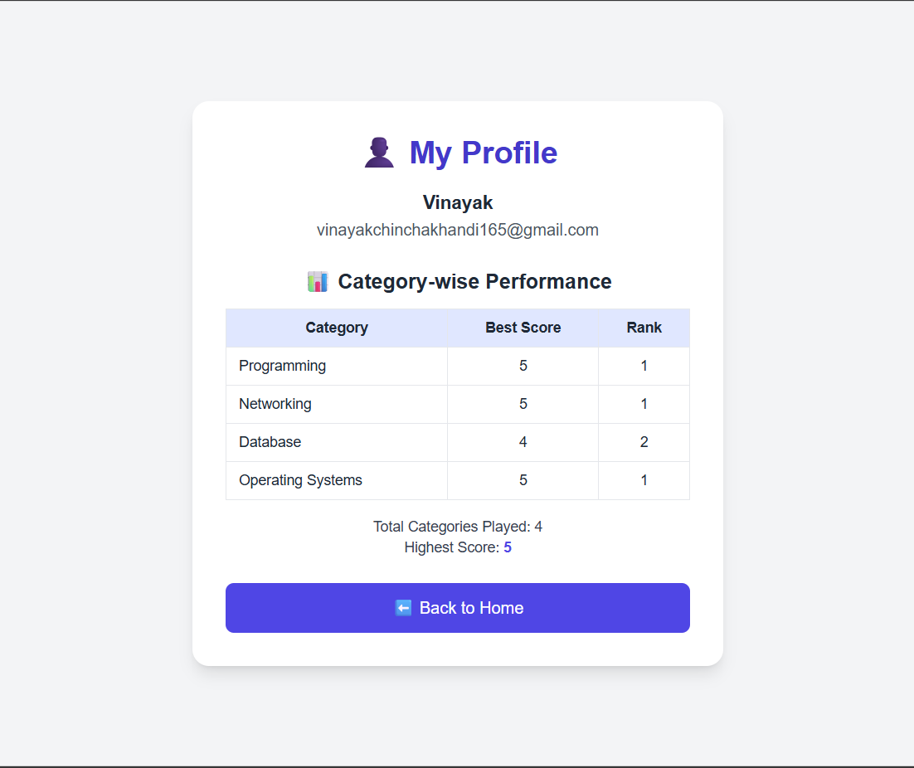
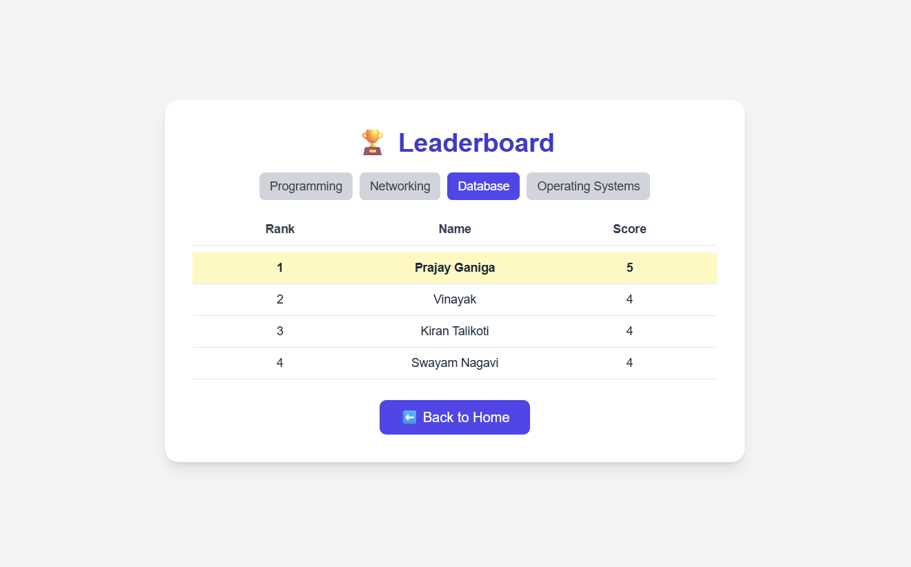
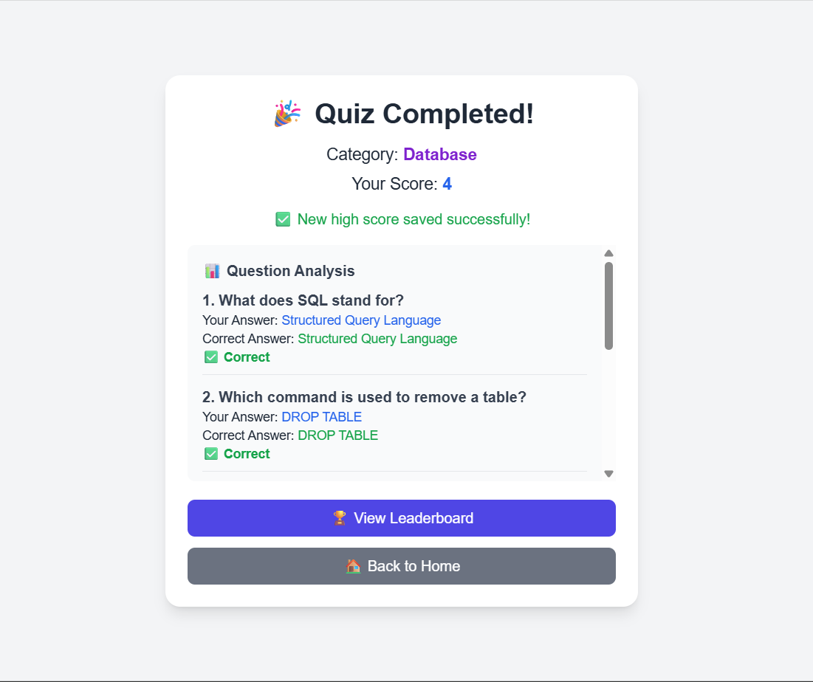

# 🧠 QuickQuiz – Interactive Quiz Application

**QuickQuiz** is a modern and interactive web-based quiz platform built with **React**.  
It allows users to test their knowledge across multiple **Computer Science categories** such as **Programming**, **Networking**, **Database**, and **Operating Systems**.  

The app provides a smooth experience with **secure login/registration**, **timed quizzes**, **leaderboards**, and **personalized user profiles**.  
All data is managed securely through **JSONBin.io**, eliminating the need for a dedicated backend.

---

## 🚀 Features
- User authentication (login & register)  
- Category-based quizzes with timer  
- Automatic scoring and question analysis  
- Category-wise leaderboard  
- User profile with best scores and rank tracking  
- Responsive design using Tailwind CSS  
- Secure cloud data storage with JSONBin.io  

---

## 🧰 Technology Stack

| Layer | Technology |
|-------|-------------|
| **Frontend Framework** | React |
| **Styling** | Tailwind CSS |
| **Routing** | React Router |
| **Validation** | Zod |
| **Data Storage** | JSONBin.io |

---

## 📁 Folder Structure (`src/`)

```bash
src/
├── App.js                   # Defines app routes & protected paths
├── index.js                 # React entry point with BrowserRouter
│
├── Login.js                 # User login page
├── Register.js              # User registration with validation
├── StartScreen.js           # Home page after login
├── CategorySelectScreen.js  # Category selection screen
├── QuizScreen.js            # Core quiz logic and timer
├── ResultScreen.js          # Displays score and analysis
├── ProfileScreen.js         # User info and category-wise rank
└── LeaderboardScreen.js     # Category-wise leaderboard
```
---

## 📸 Screenshots

### 👤 Profile Page
Displays user details, category-wise best scores, and ranking information.  



---

### 🏆 Leaderboard Page
Shows category-wise ranking, user scores, and highlights the logged-in user.  



---

### 📊 Results Page
Displays final score, detailed question-wise analysis, and quick navigation options.  



---

## 📌 Highlights

- 🌐 100% client-side – no backend server required  
- 🔒 Secure and serverless cloud data using JSONBin API  
- 🕒 Timer-based quiz with real-time score tracking  
- 🧠 Category-wise ranking and performance history  
- ⚡ Built with clean and consistent Tailwind UI  
